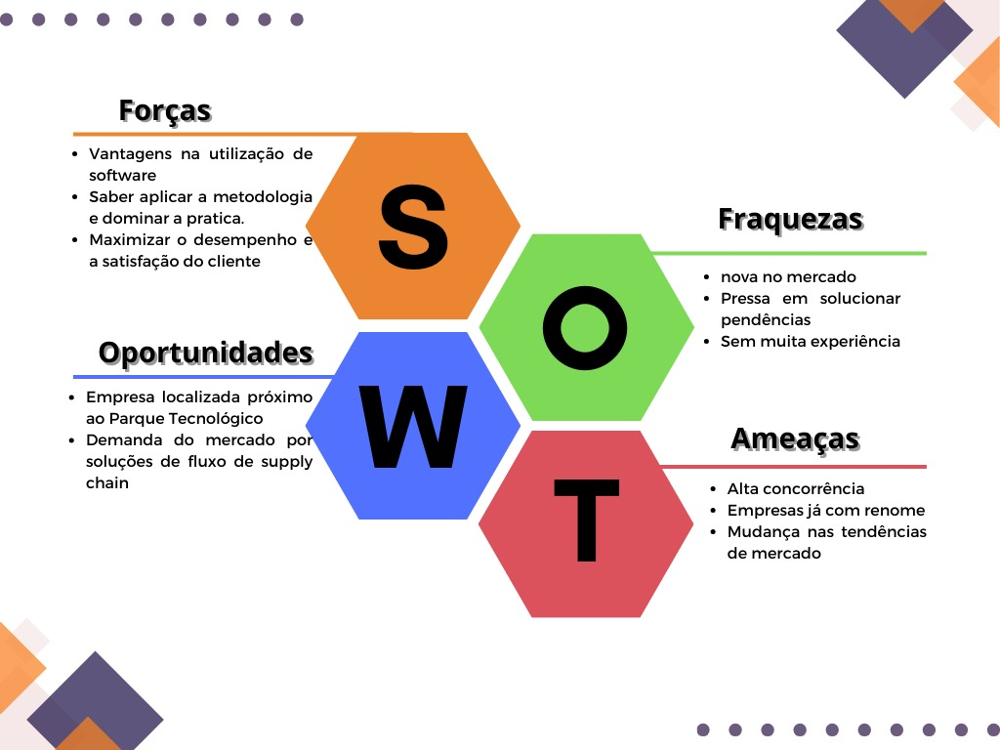

# Mapeamento dos Dados de Importação e Exportação

 
API 1° Semestre - Logística Manhã

  

   
 

 

# Índice

* [Projeto](#projeto-template)
* [Micro Certificações](#badges)
* [Equipe](#equipe)
* [Objetivo do Projeto](#objetivo-do-projeto)
* [uncionalidades e registros (vídeos e apresnetações) das sprints](#uncionalidades-e-registros-(vídeos-e-apresnetações)-das-sprints)
* [Cronograma das Sprints](#Cronograma-das-Sprints)
* [Backlog do produto](#Backlog-do-produto)
* [Burndown](#Burndown)
* [Competências desenvolvidas](#competências-desenvolvidas)
* [Autores](#autores)

## O Projeto

O projeto aborda o mapeamento do potencial de movimentação de cargas no Aeroporto de São José dos Campos (SJK) através de dados de importações e exportações de municípios. As análise voltadas para os dados de importação e exportação que contribuem as empresas a tomarem decisões mais assertiva sobre a logística de mercado. 

## Objetivo
O objetivo deste projeto é criar um sistema de otimização da movimentação de cargas no Aeroporto de São José dos Campos (SJK) por meio da análise de dados de importações e exportações de municípios próximos e relevantes. Através dessa análise de dados, pretendemos atingir oportunidades para expandir e melhorar a capacidade de armazenamento de cargas no Aeroporto de SJK, a fim de atender às crescentes demandas.

(<a href="#top">voltar ao topo</a>)

## A Empresa

> Logo

      

  
Fundada em setembro de 2023 a **WORKLOG** conectando o mundo entregando resultados, vem buscando seu lugar no mercado na importação e exportação, diferente de outras empresas globais, visando uma logística clara e eficiente com equipe qualificada. 
  
> A Equipe

| 

  
> Identidade e Propósito

**Missão** : A missão da Worklog é maximizar o desempenho e a satisfação dos nossos clientes quanto a análise da exportação e importação de suas cargas, de uma maneira simples, objetiva e ágil, onde qualquer um possa entender o processo e depositar confiança em nossos serviços.

**Visão** : Inovar continuamente nossas práticas, alinhadas a técnicas sustentáveis para melhorar a eficiência operacional e oferecer soluções logísticas aos nossos clientes.

**Valores**: Inovação, transparência e responsabilidade. Estes são os fundamentos de nossa empresa que criam um eixo forte para nossos clientes. Cremos que com uma união genuína é possível gerar negócios estratégicos e parcerias duradouras. 
  
 > SWOT da Empresa

      

  
  

(<a href="#top">voltar ao topo</a>)

  

(<a href="#top">voltar ao topo</a>)

# Cronograma das Sprints

> Cronograma

_Sprint 0 - 04/09/23 à 25/09/2023_

      

_Relatorio de Burnup_

      

_Sprint 01 - 25/09/23 à 16/10/2023_

      
<p align="center
  
_Sprint 02 - 16/10/23 à 06/11/2023_

_Sprint 03 - 06/11/23 à 27/11/2023_

