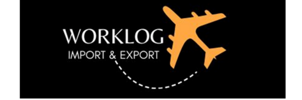

# Mapeamento dos Dados de Importação e Exportação

 
API 1° Semestre - Logística Manhã

 
  

   
 
 

## O Projeto

O projeto aborda o mapeamento do potencial de movimentação de cargas no aeroporto internacional de São José dos Campos (SJK) através de dados de importações e exportações de municípios. As análise voltadas para os dados de importação e exportação que contribuem as empresas a tomarem decisões mais assertiva sobre a logística de mercado.  

 O objetivo deste projeto é criar um sistema de otimização da movimentação de cargas no Aeroporto de São José dos Campos (SJK) por meio da análise de dados de importações e exportações de municípios próximos e relevantes. Através dessa análise de dados, pretendemos atingir oportunidades para expandir e melhorar a capacidade de armazenamento de cargas no Aeroporto de SJK, a fim de atender às crescentes demandas.

(<a href="#top">voltar ao topo</a>)

## A Empresa

> Logo

      

  
Fundada em setembro de 2023 a **WORKLOG** conectando o mundo entregando resultados, vem buscando seu lugar no mercado na importação e exportação, diferente de outras empresas globais, visando uma logística clara e eficiente com equipe qualificada. 
  
> A Equipe

| 

  
> Identidade e Propósito

**Missão** : A missão da Worklog é maximizar o desempenho e a satisfação dos nossos clientes quanto a análise da exportação e importação de suas cargas, de uma maneira simples, objetiva e ágil, onde qualquer um possa entender o processo e depositar confiança em nossos serviços.

**Visão** : Inovar continuamente nossas práticas, alinhadas a técnicas sustentáveis para melhorar a eficiência operacional e oferecer soluções logísticas aos nossos clientes.

**Valores**: Inovação, transparência e responsabilidade. Estes são os fundamentos de nossa empresa que criam um eixo forte para nossos clientes. Cremos que com uma união genuína é possível gerar negócios estratégicos e parcerias duradouras. 
  
 > SWOT da Empresa

      

  
  

(<a href="#top">voltar ao topo</a>)

  

(<a href="#top">voltar ao topo</a>)

# Cronograma das Sprints

> Cronograma

_Sprint 0 - 04/09/23 à 25/09/2023_

      

_Sprint 01 - 25/09/23 à 16/10/2023_

_Sprint 02 - 16/10/23 à 06/11/2023_

_Sprint 03 - 06/11/23 à 27/11/2023_

      

Sprint 01

>Backlog

      

  
>Burndown Chart

_Por Tempo_

      

_Por Tempo_

      

  
 

  

Sprint 02

>Backlog

      

  
>Burndown Chart
  
_Por Itens_

      

  
_Por Tempo_

      

  
  

  

Sprint 03

>Backlog

      

  
>Burndown Chart
  
_Por Itens_

      

  
_Por Tempo_

      

  
  

  

Sprint 04

>Backlog

      

  
>Burndown Chart
  
_Por Itens_

      

  
_Por Tempo_

      

  
  

  

(<a href="#top">voltar ao topo</a>)

## Resultado e Produto

Por meio de modelagem de daos, obtivemos o protótipo de dashboard executado no software QuickSight, os filtros usados na base de dados para a apresentação do dashboard foram: base histórica de 1997 a 2023, do estado de São Paulos e dos dez maiores produtos de importação e exportação.

Com isso geramos gráficos pertinentes para analisar as cadeias produtivas da RMVale e do Brasil.

A proposta deste projeto foi realizar o mapeamento da RMVALE, de suas cadeias produtivas e valores referentes a importação e exportação dos produtos dentro delas, vemos que a partir dos resultados de cada sprint, a equipe conseguiu suprir a demanda do cliente com
um dashboard realizado no software QuickSight, possibilitando análises de quaisquer dados inseridos nele.

### Exemplos de Cadeias Produtivas da RMVALE

> CADEIA AERONÁUTICA SH4 – 8802 - EXPORTAÇÃO 1° RMVALE

      

 
  

      

  

      
      

 

      

> CADEIA PETROLÍFERA SH4 – 2709 - IMPORTAÇÃO 1° RMVALE

  

      

 
  

      

  

      
      

 

      

(<a href="#top">voltar ao topo</a>)

  
## Tecnologias Utilizadas

   
 <a href="https://www.atlassian.com/software/jira">
 

 

    
 
 
 

(<a href="#top">voltar ao topo</a>)

  
  
  
  
  
  
